

<picture>  <source media="(max-width: 560px) and (prefers-color-scheme: dark)" srcset="./assets/portfolio/hero-mobile-dark.svg">  <source media="(max-width: 560px) and (prefers-color-scheme: light)" srcset="./assets/portfolio/hero-mobile-light.svg">  <source media="(min-width: 768px) and (max-width: 1011px) and (prefers-color-scheme: dark)" srcset="./assets/portfolio/hero-compact-dark.svg">  <source media="(min-width: 768px) and (max-width: 1011px) and (prefers-color-scheme: light)" srcset="./assets/portfolio/hero-compact-light.svg">  <source media="(prefers-color-scheme: light)" srcset="./assets/portfolio/hero-light.svg">  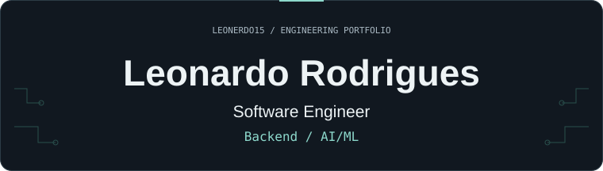</picture>

Informatics Engineering graduate 
Former AI/ML Research Fellow · UNIDCOM / IADE

<a href="https://www.linkedin.com/in/leonardo-lage-rodrigues/"><picture>  <source media="(prefers-color-scheme: light)" srcset="./assets/portfolio/linkedin-light.svg">  </picture></a>
&nbsp;
<a href="mailto:leonardolage10@gmail.com"><picture>  <source media="(prefers-color-scheme: light)" srcset="./assets/portfolio/email-light.svg">  </picture></a>

<h2>Selected work</h2>

<a href="https://github.com/Leonerdo15/projeto_tese"><picture>  <source media="(max-width: 560px) and (prefers-color-scheme: dark)" srcset="./assets/portfolio/research-mobile-dark.svg">  <source media="(max-width: 560px) and (prefers-color-scheme: light)" srcset="./assets/portfolio/research-mobile-light.svg">  <source media="(min-width: 768px) and (max-width: 1011px) and (prefers-color-scheme: dark)" srcset="./assets/portfolio/research-compact-dark.svg">  <source media="(min-width: 768px) and (max-width: 1011px) and (prefers-color-scheme: light)" srcset="./assets/portfolio/research-compact-light.svg">  <source media="(prefers-color-scheme: light)" srcset="./assets/portfolio/research-light.svg">  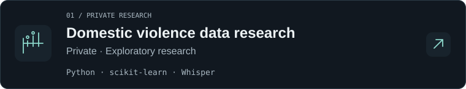</picture></a>

<a href="https://github.com/Leonerdo15/flaskProject_KNN"><picture>  <source media="(max-width: 560px) and (prefers-color-scheme: dark)" srcset="./assets/portfolio/knn-mobile-dark.svg">  <source media="(max-width: 560px) and (prefers-color-scheme: light)" srcset="./assets/portfolio/knn-mobile-light.svg">  <source media="(min-width: 768px) and (max-width: 1011px) and (prefers-color-scheme: dark)" srcset="./assets/portfolio/knn-compact-dark.svg">  <source media="(min-width: 768px) and (max-width: 1011px) and (prefers-color-scheme: light)" srcset="./assets/portfolio/knn-compact-light.svg">  <source media="(prefers-color-scheme: light)" srcset="./assets/portfolio/knn-light.svg">  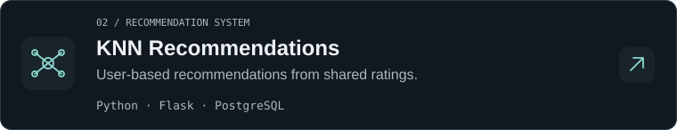</picture></a>

<a href="https://github.com/Leonerdo15/Ulide_Party2"><picture>  <source media="(max-width: 560px) and (prefers-color-scheme: dark)" srcset="./assets/portfolio/party-mobile-dark.svg">  <source media="(max-width: 560px) and (prefers-color-scheme: light)" srcset="./assets/portfolio/party-mobile-light.svg">  <source media="(min-width: 768px) and (max-width: 1011px) and (prefers-color-scheme: dark)" srcset="./assets/portfolio/party-compact-dark.svg">  <source media="(min-width: 768px) and (max-width: 1011px) and (prefers-color-scheme: light)" srcset="./assets/portfolio/party-compact-light.svg">  <source media="(prefers-color-scheme: light)" srcset="./assets/portfolio/party-light.svg">  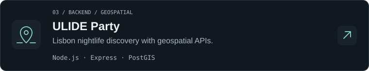</picture></a>

<a href="https://github.com/Leonerdo15/Ulide"><picture>  <source media="(max-width: 560px) and (prefers-color-scheme: dark)" srcset="./assets/portfolio/android-mobile-dark.svg">  <source media="(max-width: 560px) and (prefers-color-scheme: light)" srcset="./assets/portfolio/android-mobile-light.svg">  <source media="(min-width: 768px) and (max-width: 1011px) and (prefers-color-scheme: dark)" srcset="./assets/portfolio/android-compact-dark.svg">  <source media="(min-width: 768px) and (max-width: 1011px) and (prefers-color-scheme: light)" srcset="./assets/portfolio/android-compact-light.svg">  <source media="(prefers-color-scheme: light)" srcset="./assets/portfolio/android-light.svg">  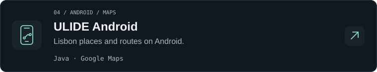</picture></a>

<a href="https://github.com/Leonerdo15/smart-helmet"><picture>  <source media="(max-width: 560px) and (prefers-color-scheme: dark)" srcset="./assets/portfolio/helmet-mobile-dark.svg">  <source media="(max-width: 560px) and (prefers-color-scheme: light)" srcset="./assets/portfolio/helmet-mobile-light.svg">  <source media="(min-width: 768px) and (max-width: 1011px) and (prefers-color-scheme: dark)" srcset="./assets/portfolio/helmet-compact-dark.svg">  <source media="(min-width: 768px) and (max-width: 1011px) and (prefers-color-scheme: light)" srcset="./assets/portfolio/helmet-compact-light.svg">  <source media="(prefers-color-scheme: light)" srcset="./assets/portfolio/helmet-light.svg">  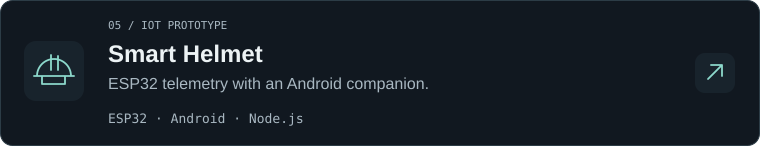</picture></a>

<h2>Toolkit</h2>

<h4>Languages</h4>

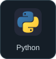
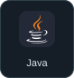
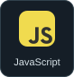

<h4>Backend &amp; databases</h4>

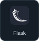
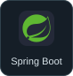
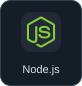
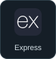
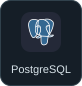
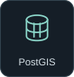

<h4>AI &amp; development tools</h4>

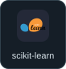
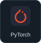
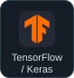
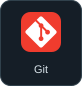
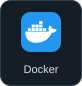

<h4>Data &amp; audio</h4>

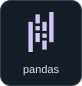
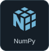
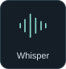
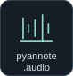

